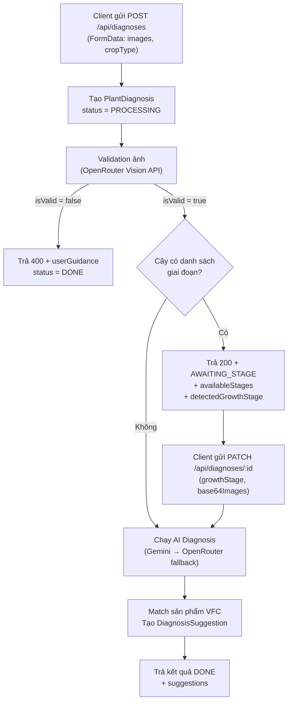
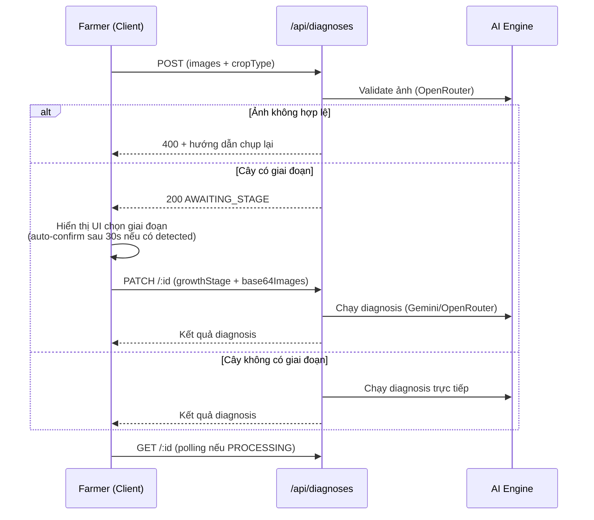

# Quy trình Chẩn đoán Dịch hại — Góc nhìn API

## Tổng quan

Quy trình gồm **2 pha chính**: Validation ảnh → AI Diagnosis, với một bước trung gian tùy chọn là xác nhận giai đoạn sinh trưởng.



---

## API Endpoints

### 1. `POST /api/diagnoses` — Tạo chẩn đoán mới

| Thuộc tính | Chi tiết |
|---|---|
| **Auth** | Bắt buộc (JWT cookie) |
| **Content-Type** | `multipart/form-data` |
| **Body** | `images` (File), `cropType` (string) |
| **Max Duration** | 90s |

#### Luồng xử lý nội bộ

1. **Upload & optimize ảnh** — Dùng `sharp` tạo 2 bản:
   - `512×512` quality 85 → cho AI diagnosis
   - `256×256` quality 40 → cho validation (nhẹ hơn)

2. **Tạo record DB** — `PlantDiagnosis` với `status = PROCESSING`

3. **Validation ảnh** — Gọi [validateImagesWithGroq()](file:///c:/projects/vfc-fs/src/lib/aiDiagnosis.ts#L289-L368) qua **OpenRouter Vision API**:
   - Model: `meta-llama/llama-3.2-11b-vision-instruct:free` (mặc định)
   - Phát hiện: `reasonCode` (`VALID` | `NOT_A_PLANT` | `WRONG_CROP` | `BLURRY_IMAGE`)
   - Phát hiện thêm: `detectedGrowthStage`, `detectedPestDisease`, `detectedSeverityLevel`

4. **Nhánh theo kết quả validation**:

   - ❌ **Ảnh không hợp lệ** → Update DB status = `DONE`, trả `400` + `userGuidance`
   - ✅ **Ảnh hợp lệ + cây có danh sách giai đoạn** → Trả `200` với:
     ```json
     {
       "id": "...",
       "status": "AWAITING_STAGE",
       "awaitingStage": true,
       "availableStages": ["Giai đoạn 1", "..."],
       "detectedGrowthStage": "hoặc null"
     }
     ```
   - ✅ **Ảnh hợp lệ + cây KHÔNG có giai đoạn** → Chạy thẳng AI diagnosis, trả kết quả

---

### 2. `PATCH /api/diagnoses/:id` — Xác nhận giai đoạn & chạy diagnosis

| Thuộc tính | Chi tiết |
|---|---|
| **Auth** | Bắt buộc, phải là owner |
| **Content-Type** | `application/json` |
| **Body** | `{ growthStage: string, base64Images: string[] }` |
| **Điều kiện** | `rawAiResponse.awaitingStage === true` |

#### Luồng xử lý

1. Kiểm tra trạng thái `AWAITING_STAGE` hợp lệ
2. Reset status → `PROCESSING`
3. Gọi [runAiDiagnosis()](file:///c:/projects/vfc-fs/src/lib/aiDiagnosis.ts#L512-L649)
4. Trả kết quả diagnosis hoàn chỉnh

> [!IMPORTANT]
> Client phải gửi lại `base64Images` vì server **không lưu trữ ảnh gốc** sau bước POST.

---

### 3. `GET /api/diagnoses/:id` — Lấy chi tiết một diagnosis

Dùng để **polling** khi status = `PROCESSING`. Trả về diagnosis kèm `suggestions` (sản phẩm đề xuất).

---

### 4. `GET /api/diagnoses` — Lịch sử diagnosis của farmer

Phân trang (`?page=1`), 10 items/trang, sắp theo `createdAt DESC`.

---

## AI Diagnosis Engine

### Hàm chính: [runAiDiagnosis()](file:///c:/projects/vfc-fs/src/lib/aiDiagnosis.ts#L512-L649)

```
Input: diagnosisId, base64Images, cropType?, growthStage?, pestDisease?, severityLevel?
```

#### Bước 1: Query dữ liệu đối chứng từ DB
- Tìm `PlanStageDisease` khớp với `cropType` + `growthStage`
- Lọc thêm theo `pestDisease`, `severityLevel` nếu có (fallback nếu kết quả rỗng)
- Giới hạn tối đa **7 records** tham khảo (random sampling nếu vượt)

#### Bước 2: Gọi AI với fallback
- **Primary**: Gemini API (`gemini-2.5-flash`)
- **Fallback**: OpenRouter API (`google/gemini-flash-1.5`)
- Timeout: **90 giây** → nếu timeout, trả `FAILED` + message yêu cầu chụp lại

#### Bước 3: Parse kết quả AI
```json
{
  "disease": "tên bệnh",
  "severity": "mức độ",
  "summary": "tóm tắt hướng xử lý",
  "confidence": 0.9,
  "vfcSolutionText": "giải pháp VFC nguyên bản",
  "solutionSets": [
    { "name": "Bộ 1", "products": ["SP1", "SP2"] }
  ],
  "reasons": { "SP1": "lý do đề xuất" }
}
```

#### Bước 4: Match sản phẩm VFC
- So khớp tên sản phẩm AI trả về với danh sách `Product` active trong DB (fuzzy match dùng `includesStr`)
- Tạo `DiagnosisSuggestion` (xóa cũ nếu chạy lại)
- Update `PlantDiagnosis`: status = `DONE`, lưu `rawAiResponse`, `summary`, `confidence`

---

## Luồng Client (tóm gọn)



---

## Status Flow

| Status | Ý nghĩa |
|---|---|
| `PROCESSING` | Đang chạy AI, client nên poll |
| `DONE` | Hoàn tất (kể cả khi validation fail hoặc AWAITING_STAGE) |
| `FAILED` | Lỗi AI hoặc timeout |

> [!NOTE]
> Trạng thái `AWAITING_STAGE` **không phải** một DiagnosisStatus riêng trong DB. Nó được biểu diễn qua `status = DONE` + `rawAiResponse.awaitingStage = true`. Client tự nhận biết qua response field `awaitingStage`.


# Walkthrough: WRONG_CROP Validation Enhancement

## Tóm tắt thay đổi

Khi farmer upload ảnh cây đúng là thực vật nhưng **sai loại** (không khớp `cropType`), hệ thống giờ trả về **thông tin hữu ích** về cây thực tế thay vì chỉ báo lỗi.

## Files Changed

### 1. [aiDiagnosis.ts](file:///c:/projects/vfc-fs/src/lib/aiDiagnosis.ts)
- Thêm field `plantInfo: string | null` vào `ImageValidationResponse`
- Cập nhật validation prompt: khi `WRONG_CROP`, yêu cầu AI mô tả chi tiết cây (tên, tình trạng, công dụng, môi trường, canh tác)
- Parser trích xuất `plantInfo` từ AI response

### 2. [route.ts](file:///c:/projects/vfc-fs/src/app/api/diagnoses/route.ts)
- `WRONG_CROP` giờ trả **200 OK** (thay vì 400) với payload:
  ```json
  { "id": "...", "status": "DONE", "wrongCrop": true, "summary": "...", "plantInfo": "..." }
  ```
- Các case khác (`NOT_A_PLANT`, `BLURRY_IMAGE`) giữ nguyên trả 400

### 3. [page.tsx](file:///c:/projects/vfc-fs/src/app/farmer/diagnose/page.tsx)
- Thêm `wrongCrop`, `plantInfo` vào type `DiagnosisResult`
- `handleSubmit` thêm nhánh xử lý `wrongCrop` (set result trực tiếp, không poll)
- UI card mới với:
  - Ảnh đã gửi
  - Tag "Cây không đúng loại" (amber)
  - Thông tin hữu ích về cây (AI-generated)
  - CTA hướng dẫn gửi đúng thông tin
  - Disclaimer AI
  - Banner liên hệ chuyên gia VFC

## Verification
- ✅ TypeScript compiles with no errors
