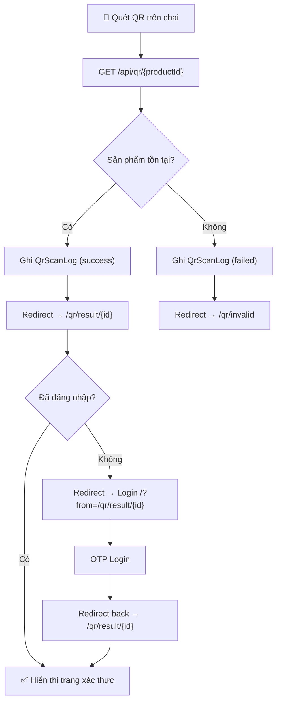

# Walkthrough – QR Code Nhận diện Sản phẩm Chính hãng

## Tổng quan
Tính năng cho phép nông dân quét QR code trên vỏ chai sản phẩm → xác thực hàng chính hãng VFC → xem chi tiết sản phẩm. Hệ thống ghi nhận mọi lượt quét để phân tích.

---

## Changes Made

### 1. Database – [schema.prisma](file:///c:/projects/vfc-fs/prisma/schema.prisma)
- **Thêm model `QrScanLog`**: Mỗi record = 1 cặp `userId + productId`, gom các lần quét vào array JSON `scans`.
- **Anti-spam**: Nếu cùng user quét cùng sản phẩm trong vòng 30 giây → bỏ qua, không ghi log.
- **Relations**: Thêm `qrScanLogs` vào cả `User` và `Product` models.

### 2. Backend APIs

#### [/api/qr/[code]](file:///c:/projects/vfc-fs/src/app/api/qr/%5Bcode%5D/route.ts) (PUBLIC)
- Nhận `code` = productId hoặc slug
- Tra cứu sản phẩm → ghi `QrScanLog` → redirect 307:
  - Thành công → `/qr/result/{productId}` (protected, cần login)
  - Thất bại → `/qr/invalid` (public)

#### [/api/qr/log](file:///c:/projects/vfc-fs/src/app/api/qr/log/route.ts) (Protected)
- Backfill `userId` vào scan log sau khi user vừa login xong
- Gọi tự động từ trang `/qr/result/[id]`

### 3. Middleware – [middleware.ts](file:///c:/projects/vfc-fs/src/middleware.ts)
- Thêm `/api/qr` và `/qr/invalid` vào `PUBLIC_PATHS`
- `/qr/result/*` vẫn **protected** → middleware auto-redirect về login kèm `?from=`

### 4. Login Page Redirect – [page.tsx](file:///c:/projects/vfc-fs/src/app/page.tsx)
- Đọc `searchParams.get("from")` → redirect về đường dẫn đó sau login thay vì luôn `/farmer`
- Fallback: nếu không có `from` → vẫn redirect `/farmer` như cũ (giữ nguyên logic)

### 5. Frontend Pages

#### [/qr/result/[id]](file:///c:/projects/vfc-fs/src/app/qr/result/%5Bid%5D/page.tsx)
- Banner **"✅ Sản phẩm chính hãng VFC"** nổi bật gradient xanh
- Hiển thị đầy đủ thông tin sản phẩm: hình ảnh, giá, SKU, hoạt chất, cây trồng, hướng dẫn sử dụng
- Nút thêm giỏ hàng sticky ở bottom
- Sản phẩm tương tự

#### [/qr/invalid](file:///c:/projects/vfc-fs/src/app/qr/invalid/page.tsx)
- Banner cảnh báo đỏ **"⚠️ QR không hợp lệ"**
- Nút quay về danh sách sản phẩm + liên hệ VFC

#### [/qr/layout.tsx](file:///c:/projects/vfc-fs/src/app/qr/layout.tsx)
- Layout riêng reuse `FarmerHeader`

### 6. Admin QR Download – [admin/products/page.tsx](file:///c:/projects/vfc-fs/src/app/admin/products/page.tsx)
- Thêm nút **QrCode** icon (xanh lá) trong cột Thao tác bên cạnh Edit/Delete
- Click → generate QR PNG (512x512, màu VFC xanh đậm) bằng thư viện `qrcode`
- QR encode URL: `{domain}/api/qr/{productId}`
- Download file tên: `QR_{product_name}.png`

---

## User Flow

---

## Verification

| Check | Result |
|-------|--------|
| TypeScript `tsc --noEmit` | ✅ No errors |
| Prisma `db push` | ✅ Schema synced |
| QR generation (qrcode lib) | ✅ Installed |
| Login redirect-back logic | ✅ Preserves existing `/farmer` fallback |
